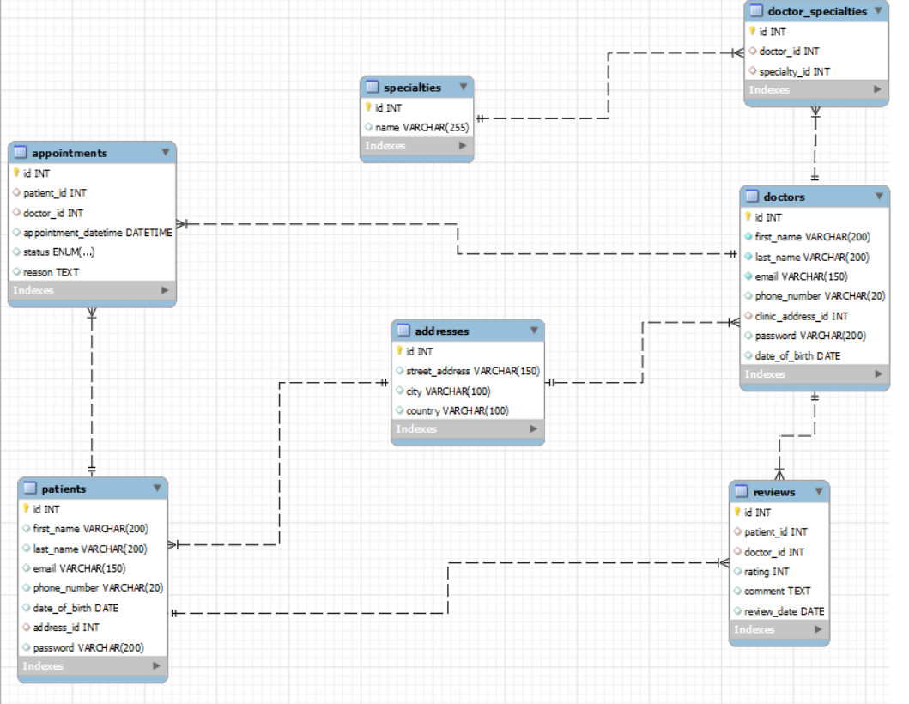

# Doctors-Appointment-Booking-System

This is a Node.js project developed by Taha Arbass that provides a RESTful API for a healthcare system. It includes routes for managing patients, doctors, addresses, doctor specialties, appointments, and reviews.

## Table of Contents

- [Getting Started](#getting-started)
- [Used Technologies and Libraries](#used-technologies-and-libraries)
- [API Endpoints](#api-endpoints)
  - [Patients](#patients)
  - [Doctors](#doctors)
  - [Addresses](#addresses)
  - [Doctor Specialties](#doctor-specialties)
  - [Appointments](#appointments)
  - [Reviews](#reviews)
  - [Services](#services)
- [Entity Relationship Diagram](#entity-relationship-diagram)

## Getting Started

To use this API:

1. Clone the project repository.
2. Run `npm install` in the project directory.
3. Configure environment variables for database and authentication in a `.env` file. Here's an example:

    ```
    PORT = your port
    DB_HOST = your host
    DB_USER = your user
    DB_PASS = your password
    DB_PORT = your db port
    DB_NAME = your name
    ```

4. Start the server with `npm start`.

## Used Technologies and Libraries

- [Node.js](https://nodejs.org/)
- [Express.js](https://expressjs.com/)
- [MySQL](https://www.mysql.com/)
- [JWT](https://jwt.io/)
- [bcrypt](https://www.npmjs.com/package/bcrypt)
- [dotenv](https://www.npmjs.com/package/dotenv)

## API Endpoints

The API includes the following endpoints:

- `/api/patients`: for managing patients
- `/api/doctors`: for managing doctors
- `/api/addresses`: for managing addresses
- `/api/doctor_specialties`: for managing doctor specialties
- `/api/appointments`: for managing appointments
- `/api/reviews`: for managing reviews

### Patients

- Retrieve All Patients: `GET /api/patients`
- Retrieve Patient by ID: `GET /api/patients/id/:id`
- Retrieve Patient by Name: `GET /api/patients/name/:first_name/:last_name`
- Retrieve Patient by Phone Number: `GET /api/patients/phone/:phone_number`
- Retrieve Patient by Email: `GET /api/patients/email/:email`
- Create a New Patient: `POST /api/patients` (Requires PatientValidator middleware)
- Sign Up: `POST /api/patients/signup` (Requires PatientValidator middleware)
- Login: `POST /api/patients/login`
- Update Patient: `PUT /api/patients/account/:id` (Requires authMiddleware and PatientValidator middleware)
- Delete Patient: `DELETE /api/patients/account/:id`

### Doctors

- Retrieve All Doctors: `GET /api/doctors`
- Retrieve Doctor by ID: `GET /api/doctors/account/:id`
- Retrieve Doctor by Name: `GET /api/doctors/name/:first_name/:last_name`
- Retrieve Doctor by Phone Number: `GET /api/doctors/phone/:phone_number`
- Retrieve Doctor by Email: `GET /api/doctors/email/:email`
- Create a New Doctor: `POST /api/doctors` (Requires DoctorValidator middleware)
- Update Doctor: `PUT /api/doctors/account/:id` (Requires DoctorValidator middleware)
- Delete Doctor: `DELETE /api/doctors/account/:id`

### Addresses

- Retrieve All Addresses: `GET /api/addresses`
- Retrieve Address by ID: `GET /api/addresses/id/:id`
- Retrieve Address by Street: `GET /api/addresses/street/:street`
- Retrieve Address by City: `GET /api/addresses/city/:city`
- Retrieve Address by Country: `GET /api/addresses/country/:country`
- Create a New Address: `POST /api/addresses` (Requires AddressValidator middleware)
- Update Address: `PUT /api/addresses/id/:id` (Requires AddressValidator middleware)
- Delete Address: `DELETE /api/addresses/id/:id`

### Doctor Specialties

- Retrieve All Doctor Specialties: `GET /api/doctor_specialties`
- Retrieve Doctor Specialty by ID: `GET /api/doctor_specialties/id/:id`
- Retrieve Doctor Specialty by Doctor ID: `GET /api/doctor_specialties/doctor/:id`
- Retrieve Doctor Specialty by Specialty ID: `GET /api/doctor_specialties/specialty/:id`
- Create a New Doctor Specialty: `POST /api/doctor_specialties` (Requires doctor_specialtyValidator middleware)
- Update Doctor Specialty: `PUT /api/doctor_specialties/id/:id` (Requires doctor_specialtyValidator middleware)
- Delete Doctor Specialty: `DELETE /api/doctor_specialties/id/:id`

### Specialties

- Retrieve All Specialties: `GET /api/specialties`
- Retrieve Specialty by ID: `GET /api/specialties/id/:id`
- Retrieve Specialty by Name: `GET /api/specialties/name/:name`
- Create a New Specialty: `POST /api/specialties/create` (Requires SpecialtyValidator middleware)
- Update Specialty: `PUT /api/specialties/id/:id` (Requires SpecialtyValidator middleware)
- Delete Specialty: `DELETE /api/specialties/id/:id`

### Appointments

- Retrieve All Appointments: `GET /api/appointments`
- Retrieve Appointment by ID: `GET /api/appointments/id/:id`
- Retrieve Appointment by Doctor ID: `GET /api/appointments/doctor/:doctor_id`
- Retrieve Appointment by Patient ID: `GET /api/appointments/patient/:patient_id`
- Retrieve Appointment by Status: `GET /api/appointments/status/:status`
- Retrieve Appointment by Date: `GET /api/appointments/date/:appointment_datetime`
- Create a New Appointment: `POST /api/appointments/create` (Requires AppointmentValidator middleware)
- Update Appointment: `PUT /api/appointments/id/:id` (Requires AppointmentValidator middleware)
- Delete Appointment: `DELETE /api/appointments/id/:id`

### Reviews

- Retrieve All Reviews: `GET /api/reviews`
- Retrieve Review by ID: `GET /api/reviews/:id`
- Retrieve Reviews by Doctor ID: `GET /api/reviews/doctor/:doctor_id`
- Retrieve Reviews by Patient ID: `GET /api/reviews/patient/:patient_id`
- Retrieve Reviews by Doctor ID and Patient ID: `GET /api/reviews/doctor/:doctor_id/patient/:patient_id`
- Retrieve Reviews by Rating: `GET /api/reviews/rating/:rating`
- Create a New Review: `POST /api/reviews` (Requires reviewValidator middleware)
- Update Review: `PUT /api/reviews/id/:id` (Requires reviewValidator middleware)
- Delete Review: `DELETE /api/reviews/id/:id`


## Entity Relationship Diagram



&copy; 2023 Taha Arbass. All rights reserved.